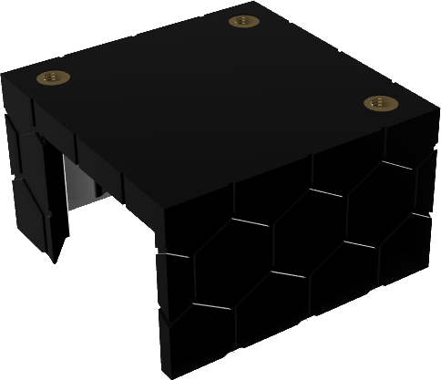
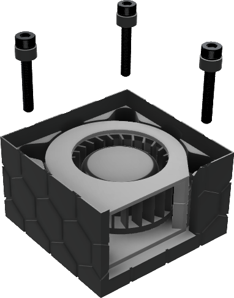
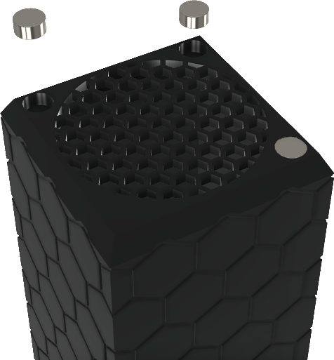
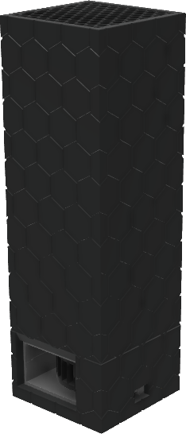

Parapet Filter Tower
====================

Tired of the smell of resin permeating my office, and generally concerned about the health effects, I started to research filtration for resin printers. Elegoo sells an official air filter, however without refills, it's battery powered, and I have doubts about the actual filtration it can manage. Taking inspiration from the Nevermore project's recirculating filters, I decided to design my own system for placing behind the vat on my Elegoo Saturn.

This filter uses standard 4mm activated carbon pellets, about 90g per fill. Wiring information is tbd, I've hacked it into my Saturn, but a better system for driving the fans is in the works. Chamber heating is also planned, and may be integrated into a new Parapet base.

### BOM

* 4020 Blower fan, preferrably dual ball bearing
  * Voltage level is up to what you can provide, heres a selection of recommendations
  * [WINSINN 40mm Blower Fan 5V Dual Ball Bearing](https://www.amazon.com/WINSINN-40x20mm-Brushless-Cooling-Extruder/dp/B07L2YKR7Y)
  * [WINSINN 40mm Blower Fan 12V Dual Ball Bearing](https://www.amazon.com/WINSINN-40x20mm-Brushless-Cooling-Extruder/dp/B07L2YT1S3)
  * [WINSINN 40mm Blower Fan 24V Dual Ball Bearing](https://www.amazon.com/WINSINN-40x20mm-Brushless-Cooling-Extruder/dp/B07L2YH79Y) 
* 3x M3 heatset inserts
* 3x M3x20 Black Oxide SHCS (Stainless will not work, as it's not as ferrous)
* 3x 6x3mm round magnets

## Printing

All files should be printed in the provided orientations, good bed adhesion is needed to get the mesh to print correctly, but otherwise this should be pretty easy. 

## Assembly

1. Install the heatset inserts in the holes in the base  
   
1. Feed the 4020 wire through the side hole, and slide the fan into the base  
   
2. Put the spacers on the m3x20 screws, and screw the fan into the base  
   
3. Install the magnets into the holes on the tower. Use glue if they don't snap fit  
   
4. Fill the tower with activated carbon and snap the lid on  
   

The tower should now "snap" onto the base magnetically, and hold well enough to carry by the tower. You can use rubber cabinet feet, or VHB tape to attach the base to your printer. Run power to the fan, either by feeding the fan wiring through the Z axis holes in the base plate, a hole in the back of your printer, etc.

You should feel a gentle breeze when the fan is running, and slight suction at the top of the tower. If you don't, your fan is not powerful enough. I've only tested a 24v fan, but it pulls suction all the way down to 11v.

## CAD

I've included a [STEP file](./CAD/Parapet.step) and [F3Z export](./CAD/Parapet.f3z) with this upload, and I've shared the full project for [Fusion 360](https://a360.co/3uRUeEG) as well. Contributions are welcome.